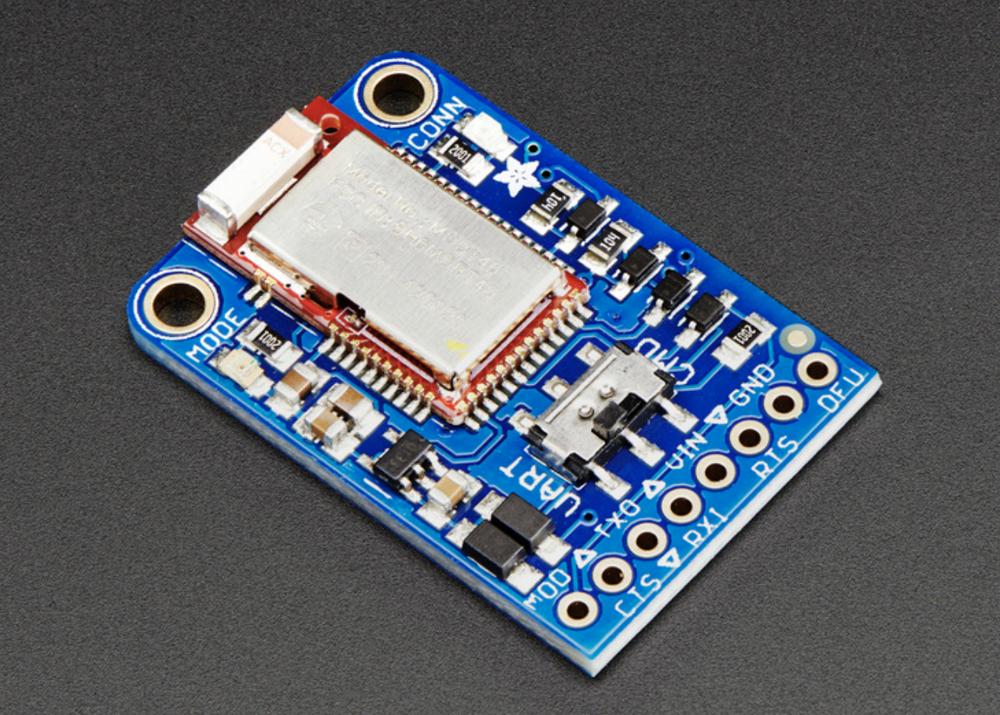

# Self-Balancing Robot
#### By: Ansh Gandhi, Ansh Bhatti, Niranjan Deepak
#### Georgia Institute of Technology

### Overview:
The purpose of this project is to design a robot with a two wheel base that can self balance when oriented vertically. Not only is this robot suppose to maintain balance it also should be able to move around.

The chasis of this robot was a custom design with hooks for attaching breadboard circuits and the motor. The chasis was created by water jetting polycarboante boards. 

Furthermore, the microcontroller used for this project is an mbed LPC 1768. Additional hardware that was utilized are an H-Bridge to control the dual motors, an IMU sensor to record gyroscopic & acceleration measurements, and a Bluetooth chip to manually control the robot.

This guide outlines the process of designing this robot including hardware and software walkthroughs along with a demo of the final robot.

### Materials:
1. [mbed LPC 1768](https://os.mbed.com/platforms/mbed-LPC1768/)
2. [IMU Sensor](https://os.mbed.com/components/LSM9DS1-IMU/)
3. [H-Bridge](https://os.mbed.com/cookbook/Motor)
4. [Adafruit Bluetooth](https://os.mbed.com/users/4180_1/notebook/adafruit-bluefruit-le-uart-friend---bluetooth-low-/)
5. [2 DC Motors](https://www.bananarobotics.com/shop/Yellow-Gear-Motor-with-48-to-1-reduction-ratio)
6. [Battery Pack](https://www.digikey.com/en/products/detail/sparkfun-electronics/PRT-09835/6161749?utm_adgroup=&utm_source=google&utm_medium=cpc&utm_campaign=PMax%20Shopping_Product_Low%20ROAS%20Categories&utm_term=&utm_content=&utm_id=go_cmp-20243063506_adg-_ad-__dev-c_ext-_prd-6161749_sig-Cj0KCQjwir2xBhC_ARIsAMTXk85yftyv_pHCKhm5V_gyFmn7Xrvi7-D7naQfL1gMGpO5F1d3YW9vyGEaAsYGEALw_wcB&gad_source=1&gclid=Cj0KCQjwir2xBhC_ARIsAMTXk85yftyv_pHCKhm5V_gyFmn7Xrvi7-D7naQfL1gMGpO5F1d3YW9vyGEaAsYGEALw_wcB)
7. [Barrel Jack Adapter](https://www.digikey.com/en/products/detail/cui-devices/PJ-102AH/408448?utm_adgroup=&utm_source=google&utm_medium=cpc&utm_campaign=PMax%20Supplier_Focus%20Supplier&utm_term=&utm_content=&utm_id=go_cmp-20243063242_adg-_ad-__dev-c_ext-_prd-408448_sig-Cj0KCQjwir2xBhC_ARIsAMTXk87SltCMliolDHcNn3urTq2zlLzNp1zLCkPbcD6KzQadYrdMgjCW7HcaAgr-EALw_wcB&gad_source=1&gclid=Cj0KCQjwir2xBhC_ARIsAMTXk87SltCMliolDHcNn3urTq2zlLzNp1zLCkPbcD6KzQadYrdMgjCW7HcaAgr-EALw_wcB)
8. [SparkFun Wheels](https://www.electromaker.io/shop/product/wheel-65mm-rubber-tire-pair?gad_source=1&gclid=Cj0KCQjwir2xBhC_ARIsAMTXk866VfV_39VTv8XwIU5cyQs2A4RIkEQxq-QjgyjtQOKmmzivmXojmj0aApZMEALw_wcB)
9. [Polycarbonate Frame](https://www.amazon.com/Polycarbonate-Plastic-Shatter-Resistant-Document/dp/B094F4D8CY/ref=asc_df_B094F4D8CY/?tag=hyprod-20&linkCode=df0&hvadid=647198461098&hvpos=&hvnetw=g&hvrand=4361963369218448029&hvpone=&hvptwo=&hvqmt=&hvdev=c&hvdvcmdl=&hvlocint=&hvlocphy=9060223&hvtargid=pla-1372682301516&psc=1&mcid=ff0c1e241f4d3c52b20e4a6d5afa5ee4) 

### Chassis Design:
Created a custom chasis design to fit our electronics and motors

### Component Schematic:

The IMU Sensor provides the mbed with accelerometer and gyroscopic measurements which is then utilized to compute appropriate values to supply to the H-Bridge. The H-birdge converts these values into appropriate values to drive the motors. The motors and mbed are each on their own power supply to prevent current spikes from affecting power to the mbed.

### Construction:

### Pin Layouts:
#### H-Bridge:

|H-Bridge Pins|mbed Pins|Motor Wires|
|:-----------:|:-------:|:---------:|
|VM|Battery Pack|-|
|VCC|VOUT|-|
|GND|GND|-|
|AO1|-| Right Motor Red|
|AO2|-|Right Motor Black|
|BO1|-|Left Motor Red|
|BO2|-|Left Motor Black|
|GND|GND|-|
|PWMA|p24|-|
|AI1|p8|-|
|AI2|p7|-|
|STBY|VOUT|-|
|PWMB|p25|-|
|BI1|p5|-|
|BI2|p6|-|
|GND|GND|-|

#### IMU:

|IMU Pins|mbed Pins|
|:-----------:|:-------:|
|SCL|p28|
|SDA|p27|
|VDD|VOUT|
|GND|GND|

#### Adafruit Bluetooth:
</img>
|BLE Pins|mbed Pins|
|:-----------:|:-------:|
|TXO|p13|
|RXI|p14|
|CTS|GND|
|GND|GND|
|Vin| Battery Pack|

### Resources:
Past Projects:
- https://os.mbed.com/users/Samer/notebook/balancing-bot/
- https://os.mbed.com/users/fmmgramacho/notebook/self-balancing-robot-segway/
- https://os.mbed.com/users/Solomon_Martin/code/Stabilize/
- https://os.mbed.com/users/pandirimukund/code/segway-balancing/
Outside Resources:
- https://vanhunteradams.com/Pico/ReactionWheel/Complementary_Filters.html
