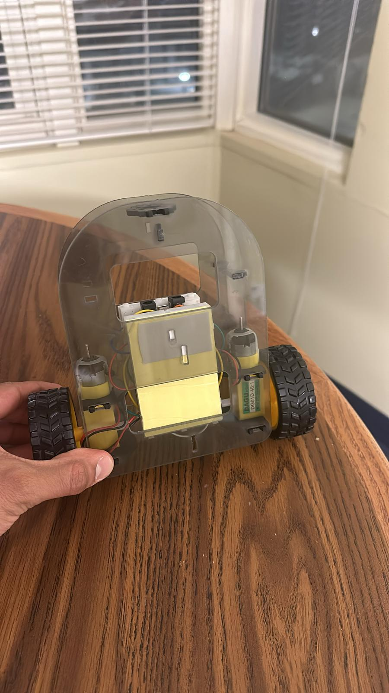
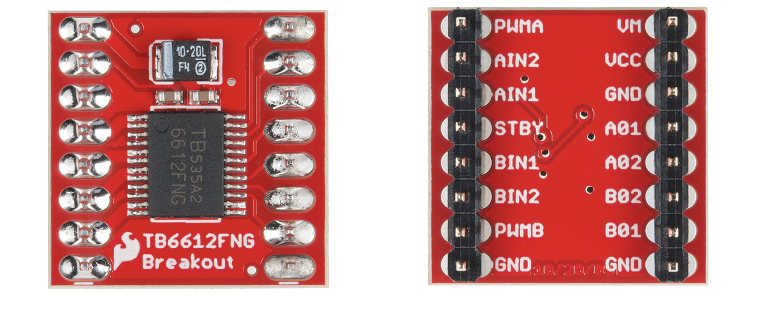
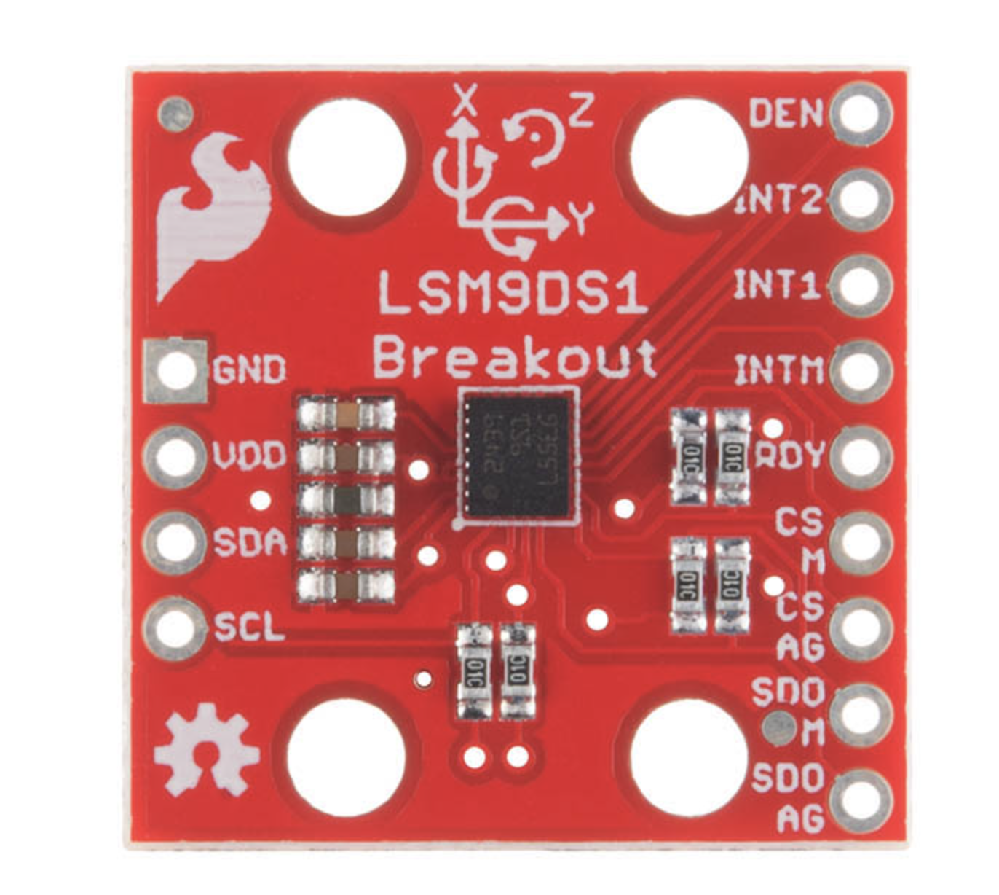

# Self-Balancing Robot
### By: Ansh Gandhi, Ansh Bhatti, Niranjan Deepak
### Georgia Institute of Technology
### ECE 4180

## Overview
The purpose of this project is to design a robot with a two wheel base that can self-balance when oriented vertically. The robot should also be able to move around by obeying commands sent via Bluetooth.

We custom designed our robot's chassis to house mounts for the two motors, battery packs, and breadboards while minimizing the overall footprint to reduce the moment of inertia. Our initial iteration was made by laser cutting acrylic, and our updated design was machined by waterjetting a 1/8" polycarbonate sheet.

We used the mbed LPC 1768 microcontroller for this project. We used an H-Bridge to control the drive motors, an IMU to record gyroscope & accelerometer measurements, and a Bluetooth chip to control the robot.

This page outlines our robot creation process, including hardware/software walkthroughs and a video demo of the final robot.

## Materials
- 1 [mbed LPC 1768](https://os.mbed.com/platforms/mbed-LPC1768/)
- 1 [LSM9DS1 IMU](https://os.mbed.com/components/LSM9DS1-IMU/)
- 1 [H-Bridge](https://os.mbed.com/cookbook/Motor)
- 1 [Adafruit Bluetooth Module](https://os.mbed.com/users/4180_1/notebook/adafruit-bluefruit-le-uart-friend---bluetooth-low-/)
- 2 [DC Motor](https://www.bananarobotics.com/shop/Yellow-Gear-Motor-with-48-to-1-reduction-ratio)
- 2 [AA Battery Pack](https://www.digikey.com/en/products/detail/sparkfun-electronics/PRT-09835/6161749)
- 2 [Barrel Jack Adapter](https://www.digikey.com/en/products/detail/cui-devices/PJ-102AH/408448)
- 2 [SparkFun Wheels](https://www.electromaker.io/shop/product/wheel-65mm-rubber-tire-pair)
- 12" x 12" [1/8" Polycarbonate Sheet](https://www.amazon.com/Polycarbonate-Plastic-Shatter-Resistant-Document/dp/B094F4D8CY)
- 2 Breadboards
- Jumper Wires

## Chassis Design
Final iteration of custom chassis design to house our electronics and motors


## Component Schematic

The mbed processes gyroscope and accelerometer measurements from the IMU and uses a PD + feedforward controller to compute appropriate motor commands. These commands are sent to the H-bridge, which sends power to drive the motors. The mbed and motors are given their own power supply to prevent motor current spikes from affecting power to the mbed.

## Robot Design Evolution
### Acrylic-Based Design w/ Horizontal Breadboard Orientation
</img>
### Polycarbonate-Based Design w/ Vertical Breadboard Orientation
</img>

## Pin Layouts
### H-Bridge:
</img>
|H-Bridge Pins|mbed Pins|Motor Wires|
|:-----------:|:-------:|:---------:|
|VM|Battery Pack|-|
|VCC|VOUT|-|
|GND|GND|-|
|AO1|-| Right Motor Red|
|AO2|-|Right Motor Black|
|BO1|-|Left Motor Red|
|BO2|-|Left Motor Black|
|GND|GND|-|
|PWMA|p24|-|
|AI1|p8|-|
|AI2|p7|-|
|STBY|VOUT|-|
|PWMB|p25|-|
|BI1|p5|-|
|BI2|p6|-|
|GND|GND|-|

### IMU:
</img>
|IMU Pins|mbed Pins|
|:-----------:|:-------:|
|SCL|p28|
|SDA|p27|
|VDD|VOUT|
|GND|GND|

### Bluetooth Module:
</img>
|BLE Pins|mbed Pins|
|:-----------:|:-------:|
|TXO|p13|
|RXI|p14|
|CTS|GND|
|GND|GND|
|Vin|Battery Pack|

## Code
Upon bootup, the robot takes 200 samples of accelerometer and gyroscope data to calibrate the bias for each sensor. To measure the robot's tilt angle, we use a [complementary filter](https://vanhunteradams.com/Pico/ReactionWheel/Complementary_Filters.html) to combine the raw values of the accelerometer and gyroscope. This filter outputs smooth IMU measurements by overcoming gyroscope drift and noisy accelerometer readings. After measuring the robot's tilt, our PD + gravity feedforward controller computes the motor speeds required to keep the robot balanced. The controller stage also accounts for linear commands received via Bluetooth by adjusting the controller's target tilt angle, and responds to angular commands by adding a constant turning speed to one motor and subtracting it from the other. Our main source code is shown below.

```cpp
#include "LSM9DS1.h"
#include "Motor.h"
#include "mbed.h"

#define CALIBRATION_CYCLES 200
#define GYRO_CONFIDENCE 0.96
#define COMMAND_FILTER 1
#define PI 3.14159265359
#define RAD_TO_DEG 180/PI

#define TILT_ANGLE 0.05
#define ROTATION_SPEED 0.3
#define RESPONSE_CYCLES 6

float kP = -10.5;
float kD = 1.0;
float kF = 0;

Serial bluetooth(p13, p14);
Motor leftMotor(p25, p6, p5);
Motor rightMotor(p24, p8, p7);
LSM9DS1 imu(p28, p27, 0xD6, 0x3C);
Serial serial(USBTX, USBRX);

float accelBias = 0;
float gyroBias = 0;

float accelAngle = 0;
float gyroAngle = -PI/2;
float currentAngle = 0;
float lastAngle = 0;

int forwardTarget = 0;
int forwardCommand = 0;
float rotationCommand = 0;

float targetAngle = 0;
float lastCommand = 0;
bool enable = false;
int adjust = 0;

void calibrateIMU() {
    for (int i = 0; i < CALIBRATION_CYCLES; ++i) {
        imu.readAccel();
        imu.readGyro();
        accelBias += atan2((float) imu.az, (float) imu.ax); // https://vanhunteradams.com/Pico/ReactionWheel/Complementary_Filters.html
        gyroBias += imu.gy;
    }

    accelBias /= CALIBRATION_CYCLES;
    gyroBias /= CALIBRATION_CYCLES;
    
    serial.printf("accelBias: %f\n", accelBias);
    serial.printf("gyroBias: %f\n", gyroBias);
}

void measure() {
    imu.readAccel();
    imu.readGyro();
    accelAngle = atan2((float) imu.az, (float) imu.ax) - accelBias - PI/2;
    if (accelAngle < -PI) {
        accelAngle += 2*PI;
    }

    float gyroVel = (gyroBias - imu.gy) * 0.00001 * 0.54;
    gyroAngle += gyroVel;

    currentAngle = GYRO_CONFIDENCE * (currentAngle + gyroVel) + (1 - GYRO_CONFIDENCE) * accelAngle;

    // serial.printf("%+3.2f %+3.2f %+3.2f\n", gyroAngle * RAD_TO_DEG, accelAngle * RAD_TO_DEG, currentAngle * RAD_TO_DEG);
    // if (bluetooth.writeable()) {
    //     bluetooth.printf("%+3.2f, %+3.2f, %+3.2f\n", gyroAngle * RAD_TO_DEG, accelAngle * RAD_TO_DEG, currentAngle * RAD_TO_DEG);
    // }
}

void controller() {
    float p = currentAngle - targetAngle - forwardCommand * TILT_ANGLE / RESPONSE_CYCLES;
    float d = currentAngle - lastAngle;
    float f = tan(currentAngle);
    lastAngle = currentAngle;

    float c = kP * p + kD * d + kF * f;
    c = COMMAND_FILTER * c + (1 - COMMAND_FILTER) * lastCommand;
    c = c < -1 ? -1 : c;
    c = c > 1 ? 1 : c;

    c *= enable;
    lastCommand = c;
    leftMotor.speed(c + rotationCommand);
    rightMotor.speed(-c + rotationCommand);

    serial.printf("%d, %+1.2f, %+1.3f, %+1.2f, %+1.2f, %+3.2f, %+3.2f, %+3.2f, %+3.2f, %d \n", adjust, kP, kD, kF, c, currentAngle * RAD_TO_DEG, targetAngle * RAD_TO_DEG, gyroAngle * RAD_TO_DEG, accelAngle * RAD_TO_DEG, forwardCommand);
    if (bluetooth.writeable()) {
        bluetooth.printf("%d, %+1.2f, %+1.3f, %+1.2f, %+1.2f, %+3.2f, %+3.2f, %+3.2f, %+3.2f, %d \n", adjust, kP, kD, kF, c, currentAngle * RAD_TO_DEG, targetAngle * RAD_TO_DEG, gyroAngle * RAD_TO_DEG, accelAngle * RAD_TO_DEG, forwardCommand);
    }
}

int main() {
    imu.begin();
    calibrateIMU();

    while (1) {
        if (!bluetooth.readable()) {
            measure();
            controller();
        } else {
            if (bluetooth.getc() == '!') {
                if (bluetooth.getc() == 'B') {
                    char bnum = bluetooth.getc();
                    switch (bnum) {
                        case '1':
                            if (bluetooth.getc() == '0') {
                                enable = !enable;
                            }
                            break;
                        case '2':
                            if (bluetooth.getc() == '1') {
                                adjust = (adjust + 1) % 4;
                            }
                            break;
                        case '3':
                            if (bluetooth.getc() == '1') {
                                targetAngle += 0.01;
                            }
                            break;
                        case '4':
                            if (bluetooth.getc() == '1') {
                                targetAngle -= 0.01;
                            }
                            break;
                        case '5':
                            if (bluetooth.getc() == '1') {
                                forwardTarget = RESPONSE_CYCLES;
                            } else {
                                forwardTarget = 0;
                            }
                            break;
                        case '6':
                            if (bluetooth.getc() == '1') {
                                forwardTarget = -RESPONSE_CYCLES;
                            } else {
                                forwardTarget = 0;
                            }
                            break;
                        case '7':
                            if (bluetooth.getc() == '1') {
                                if (adjust == 0) {
                                    rotationCommand = ROTATION_SPEED;
                                } else if (adjust == 1) {
                                    kP += 0.1;
                                } else if (adjust == 2) {
                                    kD += 0.1;
                                } else {
                                    kF += 0.1;
                                }
                            } else if (adjust == 0) {
                                rotationCommand = 0;
                            }
                            break;
                        case '8':
                            if (bluetooth.getc() == '1') {
                                if (adjust == 0) {
                                    rotationCommand = -ROTATION_SPEED;
                                } else if (adjust == 1) {
                                    kP -= 0.1;
                                } else if (adjust == 2) {
                                    kD -= 0.1;
                                } else {
                                    kF -= 0.1;
                                }
                            } else if (adjust == 0) {
                                rotationCommand = 0;
                            }
                            break;
                        default:
                            break;
                    }
                }
            }
        }

        if (forwardTarget > forwardCommand) {
            forwardCommand += forwardCommand >= RESPONSE_CYCLES ? 0 : 1;
        } else if (forwardTarget < forwardCommand) {
            forwardCommand -= forwardCommand <= -RESPONSE_CYCLES ? 0 : 1;
        }
    }
}
```

## Iterations
1. We originally powered all electronics from the same power supply. After some testing, we realized that the motors would need to be powered separately from the other electronics to avoid disruption due to current spikes.
2. We originally planned to mount the batter packs directly onto the robot, but after some testing, we realized that the motors were too weak to control a robot with such a high moment of inertia. To make the robot easier to control, we were forced to remove the batter packs and mount the breadboards lower.
3. Our initial code used raw accelerometer values to estimate the robot's tilt angle. While this worked well on a stationary robot, the robot's motion created extremely noisy data, producing severe oscillations that made it difficult to control the robot.

## Demo Videos
- Demo: https://youtu.be/zSYBFj76JRM
- Oscillation Testing: https://youtu.be/4kjMF7BKbzk
- Oscillation Testing Graphs: https://youtube.com/shorts/2Yzb6hkkgFo?feature=share
- Problematic Oscillations: https://youtu.be/JfjvGOS7Too
- Ideal Oscillations: https://youtu.be/NjUfE1U3GDE
- Polycarbonate Cutting: https://youtu.be/hWCOUB6D1Eo

## Future Plans
- More effectively use the IMU by also using magnetometer data and implementing a Kalman filter
- Use more powerful motors to comfortably incorporate batteries without compromising balance
- Use better wheels to get more traction for better control
- Improve motion controller tuning
- Make control inputs more intuitive by using joystick instead of arrow keys

## Bloopers:
Engineer performing robot surgery without an M.D. degree


## Resources:
Below are links to past projects we took inspiration from:
- https://os.mbed.com/users/Samer/notebook/balancing-bot/
- https://os.mbed.com/users/fmmgramacho/notebook/self-balancing-robot-segway/
- https://os.mbed.com/users/Solomon_Martin/code/Stabilize/
